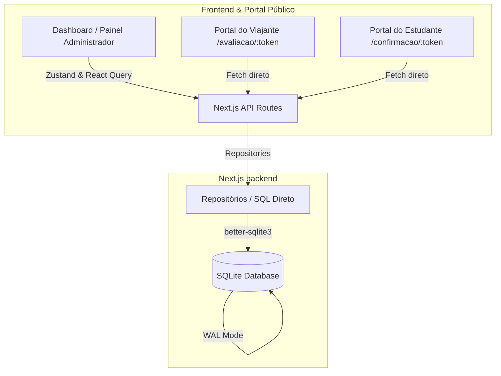
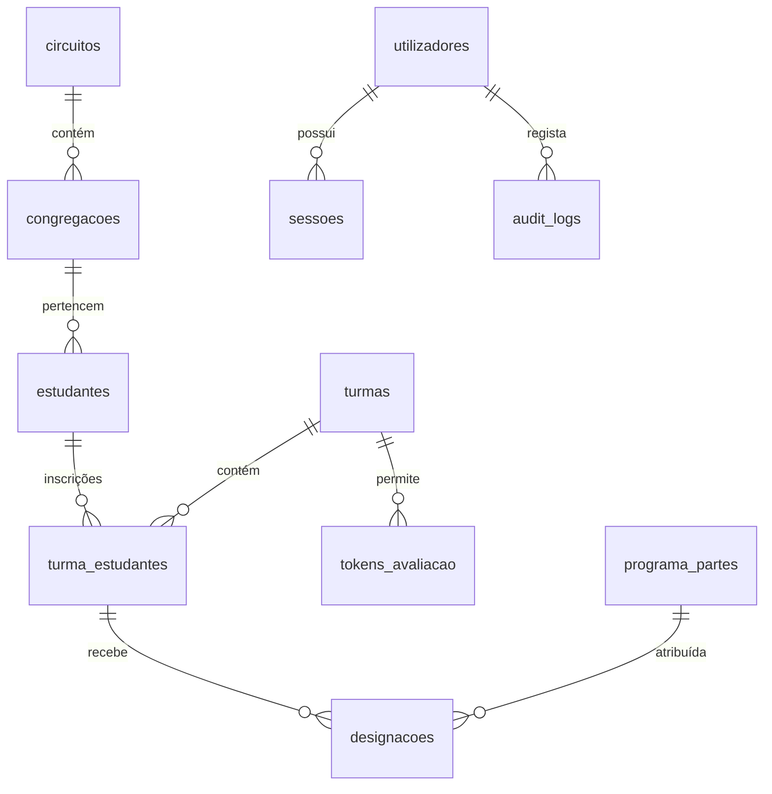

# 🏫 Relatório de Análise do Projecto School-Lab

Este documento fornece uma análise técnica detalhada do projecto **School-Lab** (EAC — Escola para Anciãos de Congregação), cobrindo a arquitectura global, modelo de dados, fluxos de negócio, mecanismos de segurança e o estado actual do desenvolvimento.

---

## 🗺️ Arquitectura do Sistema

O **School-Lab** é um sistema monolítico fullstack moderno, projectado com alta eficiência e foco no controlo total da lógica do negócio.

### Stack Tecnológica

| Camada | Tecnologia | Propósito / Papel |
| :--- | :--- | :--- |
| **Core Framework** | Next.js 15 & React 19 | Arquitectura App Router, API endpoints nativos e componentes de servidor. |
| **Linguagem** | TypeScript | Tipagem estática em toda a base de código (Interfaces de domínio). |
| **Base de Dados** | SQLite via `better-sqlite3` | Base de dados relacional rápida, síncrona e local em disco (`data/escola.db`). |
| **Controlo de Estado** | Zustand | Gestão leve de estados globais no cliente. |
| **Data Fetching** | TanStack React Query v5 & Axios | Caching, revalidação e sincronização eficiente de dados com as APIs. |
| **Estilização** | Vanilla CSS / Tailwind CSS | Estilos customizados rápidos e adaptáveis para PC, tablet e mobile. |

---

## 🗄️ Modelo e Estrutura de Dados

O projecto utiliza ficheiros de migração SQL nativos localizados em `/migrations`, geridos por um motor de migrações interno síncrono (`src/lib/db/index.ts`). O schema está modelado com chaves estrangeiras rigorosas (`ON DELETE CASCADE / SET NULL`) e índices de alta performance.

### Tabelas do Schema

> [!NOTE]
> O banco de dados opera em modo **WAL (Write-Ahead Logging)** com cache optimizada de 64MB, o que permite leituras e escritas concorrentes rápidas sem locks.

1. **`utilizadores`**: Administradores e Instrutores da plataforma. Controla o papel (`admin`, `instrutor`, `viajante`) e a flag `precisa_mudar_senha` (para redefinição obrigatória no primeiro login).
2. **`sessoes`**: Tokens de sessão aleatórios de 32 bytes (hex) para segurança avançada contra falsificação de identidade.
3. **`estudantes`**: Directório central de anciãos e servos com contacto (`email_jwpub`, `telefone_principal`).
4. **`turmas`**: Instâncias de cursos realizados com local, datas, instrutores A/B e status (`rascunho`, `activa`, `concluida`, `cancelada`).
5. **`turma_estudantes`**: Tabela associativa (M:N) que regista os inscritos numa turma, a idade actual, anos de baptismo, e o **nível de oratória** avaliado. Guarda também um `token_acesso` único para o portal público do estudante.
6. **`programa_partes`**: O template de partes do programa da escola (ex: 46 partes estruturadas de 2ª a 6ª feira).
7. **`designacoes`**: A atribuição concreta de uma parte a um estudante, contendo o status da resposta (`pendente`, `confirmada`, `realizada`, `cancelada`) e o `motivo_recusa`.
8. **`tokens_avaliacao`**: Links temporários partilhados com os Superintendentes de Circuito para classificar oradores.
9. **`audit_logs`**: Registo imutável (apenas inserções) de todas as acções administrativas.
10. **`logs`**, **`mensagens`** e **`notificacoes`**: Tabelas de suporte interno implementadas na Migração `009`.

---

## ⚙️ Principais Motores e Lógicas

### 1. Algoritmo de Designação Automática (`src/lib/repositories/designacoes.ts`)
O algoritmo é do tipo **Greedy (least-loaded)** e actua de forma transaccional com as seguintes regras de negócio:
* **Compatibilidade Estrita**: Filtra os estudantes qualificados de acordo com a matriz de compatibilidade do nível exigido pela parte (ex: nível `A/B` pode ser atribuído a oradores classificados de `A+` até `B`).
* **Limite Diário**: Evita que o mesmo estudante seja escalado para duas partes no mesmo dia.
* **Distribuição Equilibrada**: Ordena os candidatos compatíveis por número total de designações acumuladas, garantindo que todos os alunos participem equitativamente.
* **Cooperação Congregacional (Prioridade Forte)**: Em workshops e partes de grupo, o algoritmo tenta alocar estudantes da mesma congregação ou do mesmo circuito para facilitar o trabalho cooperativo.

### 2. Avaliação Descentralizada do Viajante
Para que os Superintendentes de Circuito (Viajantes) possam pontuar a oratória dos estudantes sem necessitarem de uma conta no sistema:
1. O administrador gera um link tokenizado seguro em `/avaliacao/[token]`.
2. O Viajante acede a uma pauta interactiva compatível com dispositivos móveis.
3. As classificações de `A+` a `C-` são salvas instantaneamente em tempo real na base de dados.

### 3. Confirmação Digital de Partes
Os estudantes recebem o seu link pessoal `/confirmacao/[token]`:
* Permite aceitar e confirmar as designações de forma autónoma.
* Em caso de indisponibilidade, o estudante pode rejeitar a parte indicando o motivo. A interface apresenta avisos rígidos de confidencialidade e procedimentos a tomar (ex: destruir ficheiros de apoio).

---

## 🔒 Auditoria de Segurança e Estabilidade

Fizemos uma revisão profunda às debilidades que haviam sido assinaladas em fases anteriores:

### 🟢 Vulnerabilidades Resolvidas
* **Insegurança de Cookies (Resolvido)**: O sistema de autenticação migrou de cookies contendo o UUID estático do utilizador para uma tabela de sessões dinâmica (`sessoes`). A sessão expira após 7 dias e o token é gerado com criptografia forte.
* **Injecção de SQL (Resolvido)**: As rotas de actualização dinâmica de entidades (`actualizarTurma` e `actualizarEstudante`) que usavam `Object.keys` agora aplicam uma lista branca estrita (`COLUNAS_PERMITIDAS`). Campos desconhecidos ou maliciosos são ignorados antes da montagem da query.
* **APIs Desprotegidas (Resolvido)**: Endpoints críticos administrativos como `/api/estudantes` e `/api/turmas` agora exigem sessão válida (`getSession()`) e retornam `401 Unauthorized` para acessos anónimos.

---

## 🚀 Recomendações e Melhorias Futuras

1. **Rate Limiting nas APIs Públicas**: Adicionar limitação de requisições por IP nas rotas públicas (`/api/public/*`) para evitar abusos na confirmação de partes e no portal de avaliações.
2. **Histórico de Alterações de Nota**: Registar logs de auditoria mais refinados quando as notas dos estudantes são alteradas pelos viajantes (para fins de relatórios comparativos).
3. **Optimizações no Algoritmo**: Permitir que a restrição de "máximo 1 parte por dia" seja configurável nas propriedades da turma, facilitando escolas com calendários alternativos.
